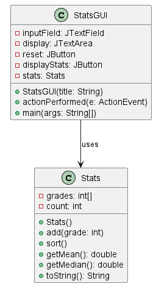
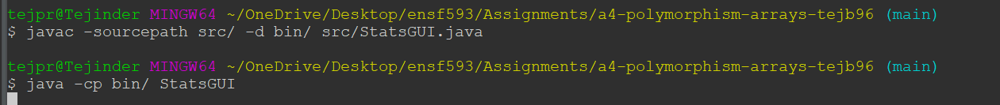
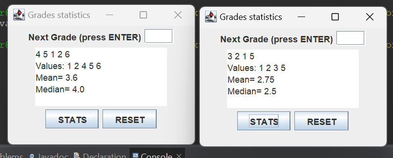

# Stats report
Author: Tej

## UML class diagram

## Execution and Testing
Execution can be done with the play button or in the terminal:

# Reflection

I like that the README.md contains many helpful explanations, such as how to calculate the median when count is odd and even or how to implement the interface IShapePoints with Rectangle. 